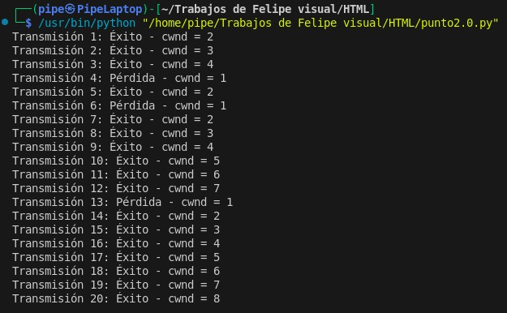
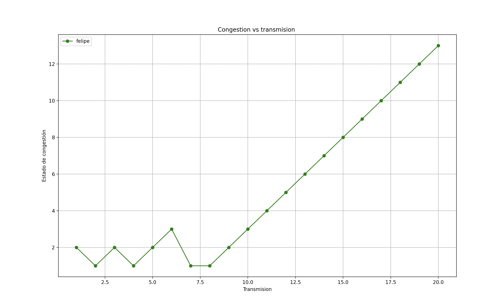

# Punto 3: Comportamiento de TCP ante Congestión de Red
## 📌 Objetivos principales  

1. **Simular la gestión de la congestión en TCP**  
   - Modelar cómo TCP ajusta dinámicamente la cantidad de datos transmitidos en función de pérdidas y éxitos.  
   - Implementar un crecimiento exponencial en la fase inicial (**Slow Start**).  
   - Reiniciar la ventana cuando hay congestión (**pérdida de paquete**).  

2. **Observar el crecimiento y reinicio de la ventana de congestión**  
   - La **ventana de congestión (cwnd)** empieza en 1 y crece en cada transmisión exitosa.  
   - Si ocurre una **pérdida de paquete**, la ventana se reinicia a 1.  
   - Se ejecutan 20 transmisiones para ver cómo evoluciona `cwnd`.  

3. **Simular eventos aleatorios de éxito o pérdida de paquetes**  
   - **Probabilidad del 80%** de éxito → Incrementa `cwnd`.  
   - **Probabilidad del 20%** de pérdida → Reinicia `cwnd` a 1.  
   - Uso de números aleatorios para hacer la simulación dinámica.  

4. **Observar la eficiencia y estabilidad del protocolo**  
   - La simulación muestra cómo TCP intenta usar más ancho de banda en condiciones estables.  
   - También ilustra cómo TCP responde agresivamente cuando detecta congestión.  

---


# Codigo en Python 💻
``` py

import random

def evento_transmision(probabilidad_exito=0.8):
    """Simula el resultado de una transmisión, devolviendo True si es exitosa."""
    return random.random() < probabilidad_exito

def simular_tcp_congestion(transmisiones=20):
    """Ejecuta una simulación de control de congestión TCP (modelo Tahoe)."""
    ventana_congestion = 1  # Estado inicial de la ventana
    registros = []

    for intento in range(1, transmisiones + 1):
        if evento_transmision():
            ventana_congestion += 1  # Aumenta si la transmisión tiene éxito
            estado = "Éxito"
        else:
            ventana_congestion = 1  # Reinicio en caso de pérdida
            estado = "Pérdida"
        
        registros.append(f"Transmisión {intento}: {estado} - cwnd = {ventana_congestion}")
    
    return registros

def mostrar_evolucion(historial):
    """Imprime el historial de la evolución de la ventana de congestión."""
    for registro in historial:
        print(registro)

# Ejecutar simulación
resultado_tcp = simular_tcp_congestion()
mostrar_evolucion(resultado_tcp)

```
# Ejemplo de ejecucion del codigo 



# Grafica de la congestion



Este código simula el control de congestión en TCP Tahoe, ajustando la ventana de congestión (cwnd) según eventos de éxito o pérdida de paquetes. La función evento_transmision() usa random.random() para simular transmisiones exitosas (80%) o fallidas (20%). simular_tcp_congestion() inicia cwnd = 1 y ejecuta 20 transmisiones, aumentando cwnd en cada éxito y reiniciándola a 1 en caso de pérdida. Los resultados se almacenan y mostrar_evolucion() los imprime. La simulación refleja fielmente cómo TCP maneja la congestión, aumentando gradualmente la ventana y reduciéndola drásticamente ante fallos, asegurando estabilidad y eficiencia en la red.
